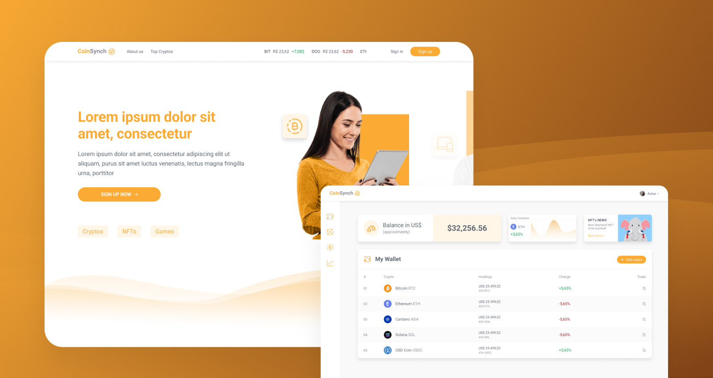

<h1 align="center">
  
</h1>

  <a href="#sobre-o-desafio">Sobre o desafio</a>&nbsp;&nbsp;&nbsp;|&nbsp;&nbsp;&nbsp;
  <a href="#layout">Layout</a>&nbsp;&nbsp;&nbsp;|&nbsp;&nbsp;&nbsp;
  <a href="#entrega">Entrega</a>&nbsp;&nbsp;&nbsp;|&nbsp;&nbsp;&nbsp;
  <a href="#bônus">Bônus</a>

## 💻 Sobre o desafio

Este desafio consiste no desenvolvimento da interface de uma landing page e uma dashboard. Os mockups estão no figma:

- Projeto: https://www.figma.com/file/B8scopEM014WR4Oh58UaDb/%5BEduSynch%5D--Front-End-Test
- Landing Page: https://www.figma.com/file/B8scopEM014WR4Oh58UaDb/%5BEduSynch%5D--Front-End-Test?node-id=1%3A1741
- Dashboard: https://www.figma.com/file/B8scopEM014WR4Oh58UaDb/%5BEduSynch%5D--Front-End-Test?node-id=1%3A2555
- Protótipo: https://www.figma.com/proto/B8scopEM014WR4Oh58UaDb/%5BEduSynch%5D--Front-End-Test?node-id=1%3A9253&scaling=min-zoom&page-id=1%3A9229&starting-point-node-id=1%3A9253&hide-ui=1

Deverá ser utilizado ReactJS (opcional a utilização de algum framework como NextJS) para desenvolvimento da landing e dashboard;

## 🔖 Layout

Você pode visualizar o layout do projeto através desse <a href="https://www.figma.com/file/2OU7V5IgEWYbEqCKvUE36j/LP---Teste-Front-End">link</a>. Vale lembrar que você precisa ter uma conta no Figma para acessá-lo. (O cadastro é gratuito)

## ⚡️ Funcionalidades

#### Landing page:

- Os dados das crypto moedas no topo da página deverão ser carregados da API Rest (https://www.coinapi.io/)
- O Banner do topo deverá ser em forma de carrossel (Mais detalhes no figma)
- Os dados das crypto moedas na seção de "Top Cryptos" deverão ser carregados da API Rest (https://www.coinapi.io/)
  - Ação do botão "View more +" deverá mostrar lista completa (10 itens);
  - Após expandir a lista, o texto "View more +" deverá ser substituido por "View less";
- O formulário de Newsletter no rodapé da página deverá ter interação a API Rest (https://www.coinapi.io/)
  - Implementar ação de "Loading" desabilitando o botão de "Subscribe" até o retorno do servidor;
  - Enquanto a ação de subscribe estiver sendo processada o usuário não poderá alterar o campo e-mail (desabilitar o preenchimento do input de texto);
  - Após retorno de sucesso do servidor, o campo e-mail deve ser limpo e o botão "Subscribe" deve estar disponível novamente;
- O botão "Sign in" deverá abrir um dialog conforme o layout;
  - O input de e-mail deverá ser validado (e-mail válido)
  - O input de password deverá ter a ação de mostrar / esconder a senha (clicando no ícone de olho);
  - "Forgot password?" não deverá ser implementado (apenas um link fake);
- O botão de "Sign Up" e o link "Don’t have an account? Sign up to CoinSynch" deverão abrir o dialog "Sign Up" conforme o figma;
  - Os campos "Name", "Email", "Password", "Confirm Password" e o checkbox "I have read and accept the Privacy Policy and Terms of User Sign up." deverão ser obrigatórios;
  - O input de e-mail deverá ser validado (e-mail válido)
  - Os inputs Passwords e Confirm Password deverão ser iguais para se tornarem válidos;
  - Ao clicar no link "Already have and account? Sign in to CoinSynch" a aplicação deverá abrir o Dialog de "Sign in" no lugar do "Sign Up";

#### Dashboard:

- O topo da página deverá ter as informações do usuário (Avatar e Nome, esses dados deverão ser consumidos da API Rest - https://www.coinapi.io/);
- O topo também deverá ter um dropdown com uma única opção (Logout);
- Menu lateral com tooltip deverá ter as funções de expandir e minimizar;
- Conteúdo deve ser exibido com os dados consumidos da API;
- O valor exibido no bloco "Balance in US$" deverá ser formatado;
- O bloco "Daily Variation" deverá mostrar um gráfico com dados consumidos da API;
- O bloco  "My Wallet" deverá mostrar a lista com dados consumidos da API;
- O botão "Add Crypto" deverá exibir o dialog "Add Crypto" com um select consumindo dados da API;
- Ao clicar no botão "Add Crypto" a listagem no bloco "My Wallet" deverá ser atualizado;
- Ao clicar no ícone da listagem do bloco "My Wallet", deverá ser exibido o dialog de "Transfer Crypto";
- O Select de "Transfer" deverá listar as opções "Transfer in" e "Transfer out";
- Caso usuário transfira todo o valor da moeda selecionada, o item deverá ser removido da listagem do bloco "My Wallet";
- O campo "Quantity" não deverá ter valor negativo;
- Ao remover todas as moedas da sua carteira, deverá ser exibida a mensagem de "Empty data" no bloco "My Wallet".

## Entrega

Ao submeter o desafio:

- Ter atenção aos detalhes visuais, o mais próximo do mockup do figma;
- O layout deverá ser fluído e responsivo, não desenvolver apenas testando os breakpoints;
- Código limpo e bem organizado;
- Estrutura semântica do HTML;
- CSS bem estruturado;
- Comentar o código, quando necessário, para explicar a intenção de trechos complexos;
- Escrever um bom README explicando como instalar e executar o projeto;
- Otimização dos assets;

Enviar o link do repositório para dayan@edusynch.com / sean@edusynch.com / rodrigo@edusynch.com.

## Bônus

- Utilização de alguma metodologia CSS (BEM);
- Utilizar Next.js ou CRA (SSR é um bônus);
- Implementação de Testes (unitário, integração, e2e...)
