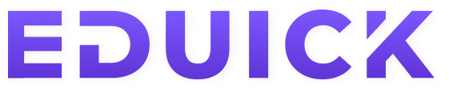
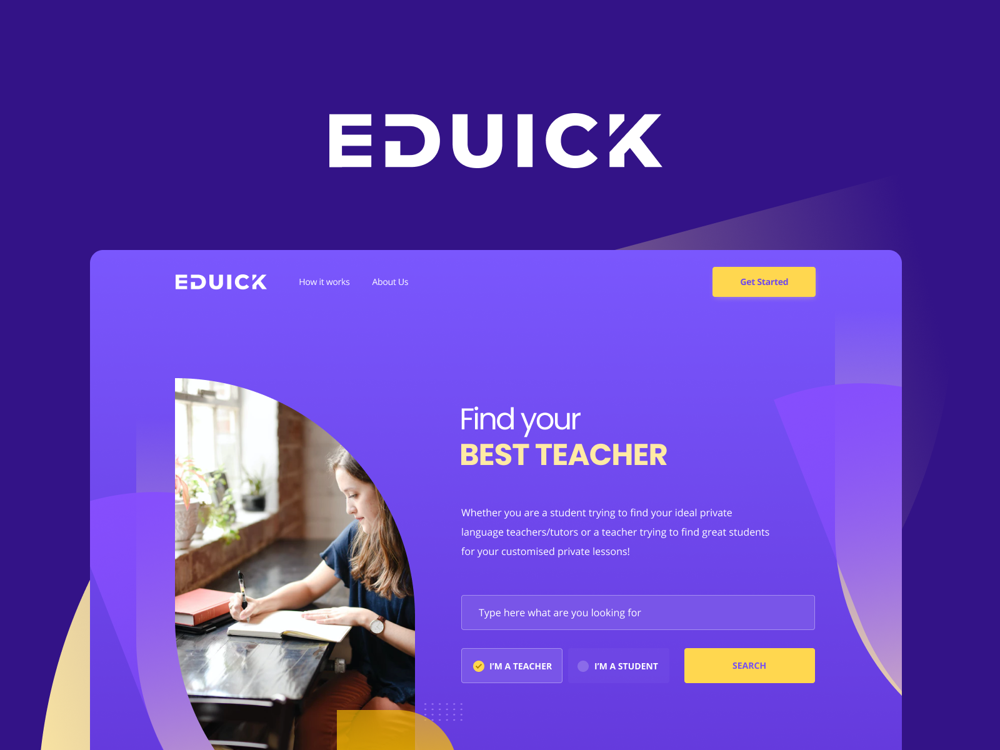

<h1 align="center">
  
</h1>

  <a href="#-sobre-o-desafio">Sobre o desafio</a>&nbsp;&nbsp;&nbsp;|&nbsp;&nbsp;&nbsp;
  <a href="#-layout">Layout</a>&nbsp;&nbsp;&nbsp;|&nbsp;&nbsp;&nbsp;
  <a href="#entrega">Entrega</a>&nbsp;&nbsp;&nbsp;|&nbsp;&nbsp;&nbsp;
  <a href="#bonus">Bônus</a>

## 💻 Sobre o desafio

Este desafio consiste no desenvolvimento da interface de uma landing page e uma dashboard. Os mockups estão no figma:

- Projeto: https://www.figma.com/file/vxbTpBRViZn0dY5EnjlVMZ/Eduick
- Landing Page: https://www.figma.com/file/vxbTpBRViZn0dY5EnjlVMZ/Eduick?node-id=102%3A793
- Dashboard: https://www.figma.com/file/vxbTpBRViZn0dY5EnjlVMZ/Eduick?node-id=14%3A295

Deverá ser utilizado AngularJS para desenvolvimento da landing e dashboard;

## 🔖 Layout

Você pode visualizar o layout do projeto através desse link. Lembrando que você precisa ter uma conta no Figma para acessá-lo.

## ⚡️ Funcionalidades

#### Landing page:

- Não será necessária a implementação da ação de enviar o formulário de busca da página principal (apenas o HTML e CSS);
- Implementar ação visual de check dos itens: "I'm a teacher" e "I'm a student";
- Arquivo modal-menu deverá ser resultado do clique no menu hamburguer (responsive mode);
- Ao clicar em "Get Started" mostrar modal de login;

#### Dashboard:

- Não será necessária a implementação dos links: "My Classes" e "Change to teacher mode";
- Adicionar requisição para trazer lista de cursos;
- Implementar scroll infinito ou paginação;
- Na versão mobile implementar ação de dropdown (onde aparece change to teacher mode);

## Testes

Será um bônus implementar algum tipo de teste (unitário, integração, e2e...)

## Entrega

Ao submeter o desafio:

- Ter atenção aos detalhes;
- Código limpo e bem organizado;
- Estrutura semântica do HTML;
- CSS bem estruturado;
- Comentar o código, quando necessário, para explicar a intenção de trechos complexos;
- Escrever um bom README explicando como instalar e executar o projeto;
- Otimização dos assets;
- Utilizar Next.js ou CRA (SSR é um bônus);

Enviar o link do repositório para dayan@edusynch.com.

## Bônus

- Utilização de alguma metodologia CSS (BEM);
- Criar um servidor em express para servir uma api estática;
